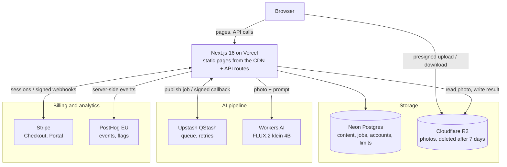
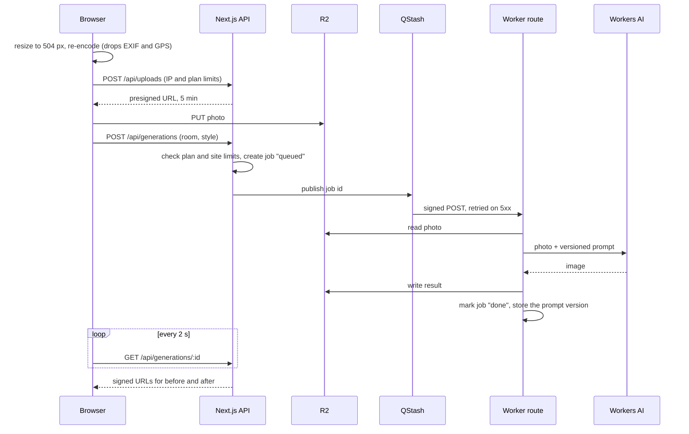

# Restyle

AI interior redesign, built SEO-first. Upload a photo of a room, pick one of 15 styles and get a
photorealistic redesign in about half a minute. Search traffic comes from programmatic landing
pages for every `room × style × locale` (8 × 15 × 2 = 240), with real before/after examples
rolled out by search demand.

**Live:** https://restyle-ai-interiors-teal.vercel.app (Ukrainian and English, Stripe in test mode)

## Highlights

- **Static, fast, indexable.** Public pages are prerendered with Next.js 16 Cache Components (the
  long tail on first visit, then cached) and served from the CDN; unknown combinations return
  real 404s. Lighthouse CI enforces mobile
  budgets on every push (median of 5 runs: LCP ≤ 2.5 s, CLS ≤ 0.1, TBT ≤ 200 ms, JS ≤ 200 KB);
  CLS is 0 and Accessibility and SEO are 100 on all six audited pages.
- **An AI pipeline that survives failures.** The browser uploads straight to storage, the job goes
  through a queue, and a signed, retry-safe worker calls the model. A site-wide daily cap keeps
  usage inside the free AI allowance, so overload degrades to a clear message, not a bill.
- **Prompts chosen by measurement.** Seven prompt versions scored on a fixed photo set with a
  rubric, one variable at a time; production runs v4 because it invents the fewest windows.
- **A full freemium funnel.** Guest → account → Pro, with limits from one entitlements module,
  Stripe subscriptions synced by idempotent webhooks, and a 50/50 trial-vs-no-trial experiment
  behind a PostHog flag. Analytics run server-side, so landing pages ship no tracking script.
- **Tested end to end without spending AI quota.** 105 unit tests and 12 Playwright tests (real
  upload → queue → worker → result with a fake model, Stripe Checkout and portal, SEO tags).
- **Decisions written down.** 14 ADRs, each with the measurements behind it.

## Architecture



One generation, from upload to result (ADR 0005):



## Key decisions

| ADR | Decision |
| --- | --- |
| [0001](docs/adr/0001-rendering-and-caching.md) | Static pages with `"use cache"` and tags; the long tail renders on first visit; real 404s |
| [0002](docs/adr/0002-web-font.md) | System font for text: a web font cost ~300 ms of mobile LCP |
| [0003](docs/adr/0003-field-web-vitals.md) | Own field Web Vitals collection alongside lab Lighthouse |
| [0004](docs/adr/0004-url-structure-and-linking.md) | URL structure, hreflang and internal linking between hubs and landing pages |
| [0005](docs/adr/0005-redesign-pipeline.md) | Direct-to-storage upload, queue, signed worker, global daily cap |
| [0006](docs/adr/0006-prompt-evaluation.md) | Prompts chosen on a fixed eval set; v1–v7 scored, production on v4 |
| [0007](docs/adr/0007-landing-page-examples.md) | A real before/after example on landing pages, generated by demand and reviewed by eye |
| [0008](docs/adr/0008-ip-rate-limiting.md) | IP rate limiting on Postgres instead of another service |
| [0009](docs/adr/0009-testing-strategy.md) | Unit tests with I/O mocked, end-to-end with a fake model; no AI quota spent |
| [0010](docs/adr/0010-accounts-and-entitlements.md) | Better Auth, plans as entitlements; pages stay static, the session is read by the API |
| [0011](docs/adr/0011-stripe-subscriptions.md) | Stripe as the source of truth, a local copy synced by idempotent webhooks |
| [0012](docs/adr/0012-product-analytics-and-paywall-experiment.md) | Server-side PostHog; the trial-vs-no-trial paywall experiment |
| [0013](docs/adr/0013-editorial-redesign.md) | Editorial redesign kept inside the budget: LCP 3.0 → 2.3 s by finding what Lighthouse actually models |
| [0014](docs/adr/0014-account-history.md) | Redesign history for accounts, limited to the 7 days photos are kept |

## Stack

- `apps/web` — Next.js 16.4 App Router, Server Components, Cache Components, Tailwind 4
- `packages/db` — Prisma 7 with PostgreSQL (Neon in production, Docker locally), seed data
- Hosting and services: Vercel, Cloudflare Workers AI and R2, Upstash QStash, Better Auth,
  Stripe (test mode), PostHog EU
- `docs/adr` — architecture decisions

## Run locally

```bash
pnpm install
pnpm db:up                 # Postgres (:5433) and S3Mock storage (:9090) in Docker
pnpm db:migrate            # apply migrations
pnpm db:seed               # 8 rooms, 15 styles, 240 pages
pnpm qstash:dev            # local queue on :8180 (separate terminal)
pnpm dev                   # http://localhost:3000
```

Production check: `pnpm build && pnpm --filter web start`.

## CI

Every push and PR runs `.github/workflows/ci.yml`: a throwaway Postgres and S3Mock start, the database is migrated and seeded, then lint, typecheck, unit tests, build, **end-to-end tests** and **Lighthouse CI** (6 pages × 5 runs, mobile, median of each metric). Budgets live in `lighthouserc.json`; a PR fails if the median performance score drops below 90, LCP exceeds 2.5 s, CLS exceeds 0.1, or JS grows past 200 KB.

Locally: `pnpm build && pnpm lhci` (needs Chrome; set `CHROME_PATH` if it is not found).

## Tests

Two layers, neither spends AI quota (ADR 0009):

```bash
pnpm --filter web test       # Vitest: pure logic and route handlers with I/O mocked, < 1 s
pnpm db:up && pnpm build
pnpm --filter web test:e2e   # Playwright + installed Chrome: real upload → queue → worker → result
```

The end-to-end run starts `next start` and the QStash dev server itself (or reuses running ones
locally) and uses the fake AI provider.

## Field metrics (RUM)

Real-user Core Web Vitals are collected by `components/web-vitals.tsx` → `POST /api/vitals` → `WebVital` table (bots and Lighthouse are dropped). See ADR 0003.

```bash
pnpm vitals:report        # p75 per page type, metric and device, last 28 days
pnpm vitals:report 7      # last 7 days
```

## Redesign tool

`/[locale]/redesign`: upload a room photo, pick a style, get a redesign (ADR 0005).

```
browser resize (≤ 504 px, drops EXIF) → presigned PUT to storage → POST /api/generations
→ QStash → /api/generations/run → AI provider → storage → browser polls for the result
```

- `AI_PROVIDER=fake` (default) tints the photo locally and costs nothing; `cloudflare` calls
  FLUX.2 [klein] 4B on Workers AI.
- Storage is S3Mock locally and Cloudflare R2 in production, through the same S3 API.
- Copy `apps/web/.env.example` to `apps/web/.env.local`; it already holds the QStash dev server's
  fixed credentials, so `pnpm qstash:dev` works without copying keys.
- Prompts are versioned in `lib/ai/prompt.ts`. Compare versions on a fixed photo set before switching
  (ADR 0006): `pnpm --filter web eval:prompts v2 v3` writes contact sheets to `apps/web/scripts/eval/out`
  (needs the Cloudflare variables in `.env.local`; ~110 neurons per image, ~1,750 per version;
  `--rooms=bathroom,kitchen` runs a subset).

## Accounts and plans

Email + password through Better Auth, sessions in Postgres (ADR 0010). Pages stay static: the
account page and the tool read `GET /api/account` from the browser.

| Plan | Generations per 24 h |
| --- | --- |
| Guest (visitor cookie) | 2 |
| Free (signed in) | 5 |
| Pro ($9 / month, Stripe) | 30 |

Set `BETTER_AUTH_SECRET` in `.env.local` (any long random string locally).

### Billing (Stripe test mode, ADR 0011)

```
account page → POST /api/billing/checkout → Stripe Checkout → Stripe → POST /api/stripe/webhook
            → Subscription row (copy of Stripe's state) → plan = pro
account page → POST /api/billing/portal → Stripe Customer Portal (card, invoices, cancel)
```

1. Put a test key in `.env.local`: `STRIPE_SECRET_KEY=sk_test_…`
2. `pnpm --filter web stripe:setup` creates the Pro product and price (found by lookup key) and a portal configuration.
3. Install the [Stripe CLI](https://docs.stripe.com/stripe-cli) and forward webhooks:
   `stripe listen --api-key $STRIPE_SECRET_KEY --forward-to localhost:3000/api/stripe/webhook`;
   put the printed `whsec_…` into `STRIPE_WEBHOOK_SECRET`.
4. Test card `4242 4242 4242 4242`, any future date and CVC. `e2e/billing.spec.ts` walks
   Checkout → Pro → portal → cancel; it is skipped when billing is not configured (CI).

## Analytics and the paywall experiment

PostHog from the server only (ADR 0012): no analytics script on landing pages. Funnel events are
recorded where they happen (`generation_requested`, `limit_reached`, `signed_up`, `paywall_viewed`,
`checkout_started`, `subscription_started`, …); page views come from one small beacon
(`/api/events`). The feature flag `paywall-trial` splits eligible Free users 50/50 between paying
now and a 7-day trial (Stripe `trial_period_days`). Set `POSTHOG_KEY` and `POSTHOG_HOST` to enable.

## Before/after examples

Each landing page shows a real redesign of its room in its style (ADR 0007), the unique content
programmatic pages need. Generated in batches by search demand, reviewed by eye, then committed:

```bash
pnpm --filter web examples:generate --limit 20   # needs the Cloudflare variables in .env.local
```

Images go to `apps/web/public/examples`, the list to `apps/web/src/data/examples.json`. Mark a bad
result with `"rejected": "<reason>"`; it is never shown and never regenerated.

## Code layout

`apps/web/src`:

- `app/` routes. A page reads data, shapes it and lists its sections; it holds little markup.
- `components/<feature>/` sections and client widgets: `home/`, `idea/` (landing pages),
  `redesign/` (the tool), `account/`, `layout/` (header, footer). Client logic sits in hooks
  (`use-generation.ts`, `use-account.ts`) and pure functions with unit tests (`errors.ts`);
  the components only render.
- `components/ui/` small shared pieces: `button()` class names for buttons and links,
  palette swatches and tiles, chip links, the first-screen image, the page header.
- `lib/` server and shared logic: data access, auth, billing, limits, analytics, storage;
  `lib/i18n/` has one dictionary file per locale, and `en.ts` is typed by `uk.ts`, so a missing
  translation fails the type check.

## Routes

| URL | Rendering |
| --- | --- |
| `/uk`, `/en` | static |
| `/[locale]/ideas/[room]` | static (all rooms) |
| `/[locale]/styles/[style]` | static (all styles) |
| `/[locale]/redesign` | static shell, client form; room and style preselected from the query |
| `/[locale]/account` | static shell, client panel; `noindex` |
| `/api/auth/*` | Better Auth (sign-up, sign-in, sign-out, session) |
| `/api/account` | who is signed in, plan, used today, subscription, Pro offer |
| `/api/account/generations` | the account's finished redesigns from the last 7 days, signed image URLs (ADR 0014) |
| `/api/billing/checkout`, `/api/billing/portal` | Stripe Checkout and Customer Portal sessions |
| `/api/stripe/webhook` | Stripe events, signature-verified, idempotent |
| `/api/events` | page-view beacon → PostHog |
| `/[locale]/ideas/[room]/[style]` | top 40 per locale at build, rest on first visit then cached |
| `/sitemap.xml`, `/robots.txt` | static, hreflang alternates in sitemap |
| `/` | 307 to `/uk` or `/en` by `Accept-Language` (`src/proxy.ts`) |

## SEO checklist (done)

- `generateMetadata` with title, description, canonical, hreflang (`uk-UA`, `en`, `x-default`)
- JSON-LD: `WebSite` on the home pages (the site name in results), `BreadcrumbList` on every inner page, `FAQPage` on landing pages
- Own favicon (`app/favicon.ico`, `icon.png`, `apple-icon.png`); `e2e/seo.spec.ts` checks the site name, icons, canonical, hreflang and structured data
- Real 404 for unknown combinations (no soft 404, see ADR 0001)
- System font stack for text; Playfair Display for headings on wide screens only, so phones download no font (ADR 0002, 0013); landing pages ship only a sub-kilobyte before/after slider

## Notes

- Windows: if `pnpm install` hangs while linking, run `pnpm config set package-import-method copy --location=global`.
